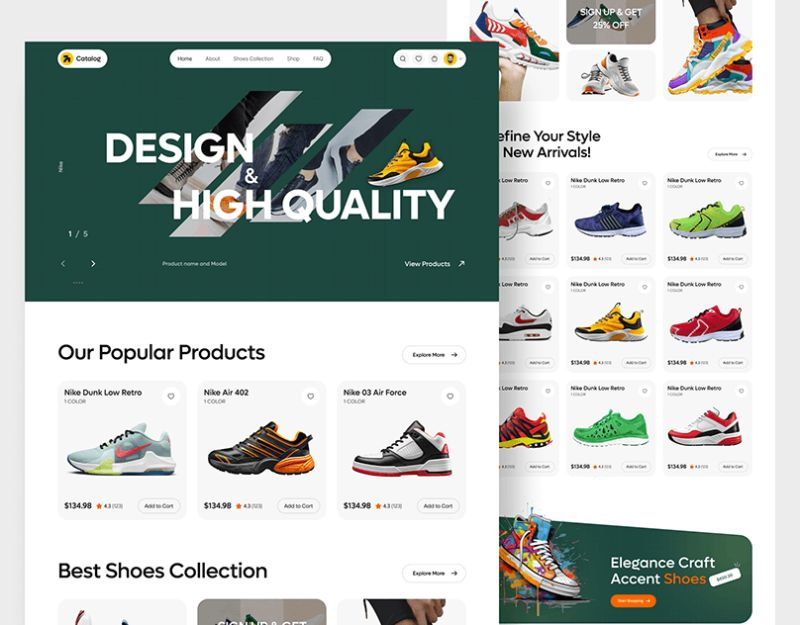

# 🏀 Nike-Inspired E-Commerce Website



A modern, responsive, and visually engaging Nike product showcase built with HTML, CSS, and JavaScript. This website replicates the aesthetic and user experience of a professional e-commerce store, with clean layouts, hover effects, and intuitive browsing.

## 🌟 Features

- 🛍️ **Responsive Product Grid** – Dynamic layout that adapts to mobile, tablet, and desktop screens.
- 🎥 **Hover Interactions** – Product highlights, color variations, and ratings upon hover.
- 📱 **Mobile-Friendly Navigation** – Optimized header and menu for mobile browsing.
- 🎨 **Modern UI/UX Design** – Inspired by Nike’s product visual language and branding.
- 💼 **Multiple Pages** – Including product collections, details, and call-to-action banners.

## 🖥️ Live Demo

🔗 [Visit the Website](https://ahmedhamdy272.github.io/Nike/)

## 📂 Project Structure
```
Nike/
├── index.html
├── css/
│ └── style.css
├── js/
│ └── script.js
├── images/
│ └── [product images, UI assets]
├── screenshot.jpeg
└── README.md
```
bash
Copy
Edit

## ⚙️ Getting Started

To run the project locally:

1. Clone the repository:

```bash
git clone https://github.com/ahmedhamdy272/Nike.git
cd Nike
Open index.html directly in your browser
or use Live Server:

bash
Copy
Edit
npm install -g live-server
live-server
```

🔧 Technologies Used

HTML5

CSS3 (Flexbox & Grid)

JavaScript (Vanilla)

📸 Screenshot
Included in this repo:


🧑‍💻 Author
Ahmed Hamdy
GitHub: @ahmedhamdy272

📜 License
This project is open source and available under the MIT License.

💡 Want to improve this site? Pull requests and feedback are welcome!

yaml
Copy
Edit

---
